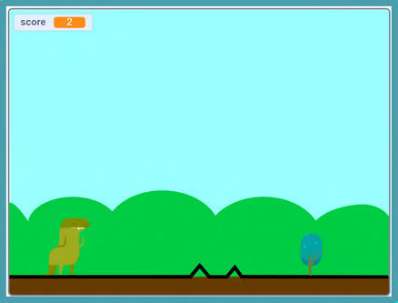
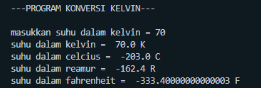
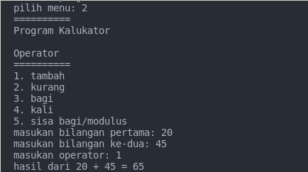

# PJBL-rpl

<!DOCTYPE html>
<html lang="en">
<head>
    <meta charset="UTF-8">
    <meta name="viewport" content="width=device-width, initial-scale=1.0">
    <title>Portofolio Saya</title>
     <link rel="stylesheet" href="portofolio.css">
    
</head>
    <body>
        <nav class="navbar">
            

                

                    

                        

                            <h2>Halo, Saya Ananda Nauval👋</h2>
                        
  
                    

                        <ul class="nav-menu">
                            <li><a href="#home">Beranda</a></li>
                            <li><a href="#tentang">Tentang</a></li>
                            <li><a href="#keahlian">Keahlian</a></li>
                            <li><a href="#proyek">Proyek</a></li>
                            <li><a href="#achievment">Prestasi</a></li>
                            <li><a href="#form">Form</a>
                            <li><a href="#kontak">Kontak</a></li>
                        </ul>
                    

                        
                        
                        
                    

                

                    
                

            

        
        </nav>
    <section id="home">
        

            

                

                    <h1 class="hero-title">Halo, Saya Nauval</h1>
                    
Siswa RPL di SMK N 1 Purbalingga saat ini saya duduk dibangku kelas 10

                    

                        Saya tertarik dalam memasuki dunia pengembangan perangkat lunak
                        karena banyak peluang pekerjaan seperti game development, web development and desktop application
                    

                    
                    
                    

                        <a href="#kontak" class="btn btn-secondary">Hubungi Saya</a>
                    

                    
 
                        

                            <i class="fas fa-user-circle"></i>
                        

                    

                

            

        

    </section>
    <section id="tentang">
        

            <h2 class="section-title">Tentang Saya</h2>
            

                

                    

                        <h3>🎨 Hobi</h3>

                        

                        Hobi saya termasuk bermain game,
                        mendengarkan musik.
                        

                    

                    

                        Saya adalah seorang siswa kelas X jurusan Rekayasa Perangkat Lunak (RPL) di SMK N 1 Purbalingga. 
                        Sejak masuk di jurusan ini, saya telah saya telah belajar tentang dunia development
                    

                    

                        Dengan dedikasi dan kerja keras, saya terus belajar dan mengembangkan kemampuan dalam berbagai bahasa pemrograman 
                        dan teknologi web terkini. Saya percaya bahwa pembelajaran berkelanjutan adalah kunci untuk sukses di industri teknologi.
                    

                    

                        Saya juga aktif mengikuti berbagai proyek sekolah dan meningkatkan kemampuan dan 
                        pengalaman saya. Tujuan saya adalah menjadi seorang developer profesional yang dapat berkontribusi positif 
                        dalam industri teknologi Indonesia.
                    

                

                

                    

                        <h3>Sekolah</h3>
                        
SMK N 1 Purbalingga

                    

                    

                        <h3>Jurusan</h3>
                        
Rekayasa Perangkat Lunak (RPL) atau Pengembangan Perangkat Lunak dan Gim(PPLG)

                    

                    

                        <h3>Fokus</h3>
                        
Web, Desktop application, Game develop & Mobile Development

                    

                

            

        

    </section>

    <section id="keahlian">
        

            <h2 class="section-title">Keahlian</h2>
            

                
                

                    <h3><i class="fas fa-code"></i> Frontend Development</h3>
                    

                        

                            HTML5
                            

                                

                            

                        

                        

                            CSS
                            

                                

                            

                        

                        

                            JavaScript
                            

                                

                            

                        

                        
                    

                

                
                

                    <h3><i class="fas fa-server"></i> Codingan sederhana</h3>
                    

                    
                        

                            Scratch
                            

                                

                            

                        

                        

                            Python
                            

                                

                            

                        

                        

                            C#
                            

                                

                            

                        

                    

                

                <h3><i class="fas fa-tools"></i> Tools & Lainnya</h3>
                    

                        

                            GitHub
                            

                                

                            

                        

                        

                            Visual Studio Code
                            

                                

                            

                        

                        

                            Programiz
                            

                                

                            

                        

                    

                </h3>
            

        

        <section id="proyek">
            

                <h2 class="section-title">Proyek Saya</h2>
                

                    

                        

                            <i class="fas fa-globe"></i>
                        

                        

                            <h3>Website Wisata dan makanan</h3>
                            
                            
Sebuah platform rekomendasi wisata dan makanan khas indonesia yang dibangun dengan HTML, CSS, dan JavaScript.

                            

                                HTML
                                CSS
                                JavaScript
                            

                        
                        

                    

                    

                        

                            <i class="fas fa-book"></i>
                        

                        

                            <h3>Game sederhana</h3>
                            
                            
Game sederhana yang cocok dimainkan ketika jenuh, mirip dengan game dino digoogle

                            

                                Scratch
                            
                            

                        
                        

                    

                    

                        

                            <i class="fas fa-mobile-alt"></i>
                        

                        

                            <h3>Aplikasi Desktop megkonversi suhu</h3>
                            
                            
Aplikasi desktop yang dapat merubah berbagai suhu (kelvin, celcius, dan fahrenheit)

                            

                                Python
                            
                            

                        
                        

                    

                    

                        

                            <i class="fas fa-users"></i>
                        

                            

                                <h3>Aplikasi kasir sederhana</h3>
                                
                                
Aplikasi khusus kasir dengan menginput jumlah barang, harga barang, nama kasir, total, dan diskon

                                

                                    C#
                                    Python
                            
                                

                                <a href="#" class="https://www.programiz.com/online-compiler/79JWxmxmAi7EX">Lihat Proyek <i class="fas fa-arrow-right"></i></a>
                            

                    

                
                

            

        </section>
    
        <section id="achievment">

            <h2>Prestasi</h2>

            <table>

                <tr>
                    <th>No</th>
                    <th>Prestasi</th>
            
                </tr>

                <tr>
                    <td>1</td>
                    <td>Harapan 2 Lomba story telling MGMP Kabupaten</td>
                
                </tr>

                <tr>
                    <td>2</td>
                    <td>Harapan 1 Lomba MAPSI kabupaten purbalingga(Tahfidz)</td>
                
                </tr>

            </table>

        </section>

        <section id="form">
                
            <form id="biodata-form">
                <fieldset>
                    <legend>Form Biodata</legend>
                            

                                

                                    <label for="nama-lengkap">Nama Lengkap :</label>
                                    <input id="nama-lengkap" name="nama_lengkap" type="text"
                                    placeholder="Masukkan nama lengkap Anda di sini">
                                 

                            

                        

                            <label for="tempat-lahir">Tempat Lahir :</label>
                            <input id="tempat-lahir" name="tempat_lahir" type="text" placeholder="Tempat Lahir">
                        

                        

                            <label>Tanggal Lahir :</label>
                            <input type="date" name="tgl_lahir">
                        

                        

                            <label>Email</label>
                            <input type="email" name="email" placeholder="Masukkan email Anda">
                        

                        

                            <label for="password">Password :</label>
                            <input id="password" type="password" name="password" placeholder="••••••••">
                        

                        <label>Jenis Kelamin :</label>
                        <tr>
                            <td>
                                <input type="radio" name="jk" value="Laki-laki"> Laki-laki
                                <input type="radio" name="jk" value="Perempuan"> Perempuan
                            </td>
                        </tr>
                            

                                <label for="story">Alamat :</label>
                                <textarea id="story" name="story" rows="4" placeholder="Masukkan alamat lengkap Anda"></textarea>
                            

                            <label>Hobi :</label> 
                            

                                
                                <input type="checkbox" > Menonton 
                                
                            

                            

                                
                                <input type="checkbox"> Gaming
                                
                            

                            

                                
                                <input type="checkbox"> Olahraga
                                
                            

                            

                                <input type="checkbox"> Membaca
                                
                            

                            

                    
                                <input type="checkbox"> Mendengarkan Musik
                                
                            

                            

                            
                                <input type="checkbox"> Memasak 
                                
                            

                            

                                <label for="agama">Agama :</label>
                                <select name="agama" id="agama">
                                    <option value="Islam">Islam</option>
                                    <option value="Kristen">Kristen</option>
                                    <option value="Katolik">Katolik</option>
                                    <option value="Hindu">Hindu</option>
                                    <option value="Budha">Budha</option>
                                    <option value="Konghuchu">Konghuchu</option>
                                </select>
                            
     
                        

                            <label for="Telepon">Nomor Telepon :</label>
                            <input id="Telepon" type="tel" name="nomor_telepon"
                                   placeholder="08xxxxxxxxxx"
                                   pattern="[0-9]{8,15}"
                                   inputmode="numeric"
                               oninput="this.value=this.value.replace(/[^0-9]/g,'')">     
                        

                        <input type="submit" value="Kirim" class="btn-submit">
                    </legend>

                </fieldset>
            </form>
        </section>
        

        <section id="kontak">

            <h2>Kontak Personal</h2>

            

                
<b>📍 Alamat:</b> Purbalingga, Jawa Tengah

                
<b>📞 No HP:</b> 085860487199

                
<b>📧 Email:</b> nandabagaskra@gmail.com

                
<b>📸 Instagram:</b>
                    <a href="https://www.instagram.com/pall_gas?igsh=MWNvdGpiemc2bnExMg==" target="_blank">@pall_gas</a>
                

            

        

        </section>
        
    <footer>

        
© 2026 | Website by Ananda Nauval

    </footer>
    
    

    

         
    </body>
</html>

/* ===== RESET & BASE STYLES ===== */
*{box-sizing:border-box}
html,body{
    height:100%
}

.container{
    max-width:1100px;
    margin:0 auto;
    padding:28px
}
html {
    scroll-behavior: smooth;
}

header {
            background: linear-gradient(135deg, #667eea 0%, #764ba2 100%);
            color: white;
            padding: 20px 40px;
        }

a {
    text-decoration: none;
    color: inherit;
}
body{
    background: #f4f7fb;
    margin: 0;
    padding: 20px;
    font-family: Arial, Helvetica, sans-serif;
}

.warna{
    background: linear-gradient(to right, #6dd5fa, #2980b9);
    border-radius: 25px;
    padding-bottom: 80px;
    box-shadow: 0 10px 30px rgba(0,0,0,0.1);
}

/* ==================== UTILITY CLASSES ==================== */
.container {
    max-width: 1200px;
    margin: 0 auto;
    padding: 0 20px;
}

.section-title {
    font-size: 3rem;
    font-weight: bold;
    text-align: center;
    margin-bottom: 3rem;
    position: relative;
    display: inline-block;
    width: 100%;
}

.section-title::after {
    content: '';
    position: absolute;
    bottom: -10px;
    left: 50%;
    transform: translateX(-50%);
    width: 100px;
    height: 4px;
    background: linear-gradient(90deg, var(--primary-color), var(--secondary-color));
    border-radius: 10px;
}

.highlight {
    color: var(--primary-color);
    font-weight: 600;
}

.btn {
    display: inline-block;
    padding: 12px 30px;
    border-radius: var(--border-radius);
    text-decoration: none;
    font-weight: 600;
    transition: var(--transition);
    cursor: pointer;
    border: none;
    font-size: 1rem;
}

.btn-primary {
    background: linear-gradient(135deg, var(--primary-color), var(--secondary-color));
    color: var(--white);
    box-shadow: 0 4px 15px rgba(99, 102, 241, 0.3);
}

.btn-primary:hover {
    transform: translateY(-3px);
    box-shadow: 0 6px 25px rgba(99, 102, 241, 0.4);
}

.btn-secondary {
    background: var(--white);
    color: var(--primary-color);
    border: 2px solid var(--primary-color);
}

.btn-secondary:hover {
    background: var(--primary-color);
    color: var(--white);
    transform: translateY(-3px);
}

/* ==================== NAVBAR ==================== */
.logo h1 {
    font-size: 1.8rem;
    background: linear-gradient(135deg, var(--primary-color), var(--secondary-color));
    -webkit-background-clip: text;
    -webkit-text-fill-color: transparent;
    background-clip: text;
}

.nav-menu {
    display: flex;
    list-style: none;
    gap: 2rem;
}
 
.nav-link {
    color: var(--text-dark);
    text-decoration: none;
    font-weight: 500;
    transition: var(--transition);
    position: relative;
}

.nav-link::after {
    content: '';
    position: absolute;
    bottom: -5px;
    left: 0;
    width: 0;
    height: 2px;
    background: var(--primary-color);
    transition: var(--transition);
}

.nav-link:hover::after {
    width: 100%;
}

.hamburger {
    display: none;
    flex-direction: column;
    cursor: pointer;
    gap: 5px;
}

.hamburger span {
    width: 25px;
    height: 3px;
    background: var(--text-dark);
    border-radius: 3px;
    transition: var(--transition);
}

/* ==================== HERO SECTION ==================== */
.hero {
    padding: 80px 0;
    background: linear-gradient(135deg, rgba(99, 102, 241, 0.1), rgba(139, 92, 246, 0.1));
    min-height: 100vh;
    display: flex;
    align-items: center;
}

.hero-content {
    display: grid;
    grid-template-columns: 1fr 1fr;
    gap: 3rem;
    align-items: center;
}

.hero-text {
    animation: slideInLeft 0.8s ease;
}

.hero-title {
    font-size: 3.5rem;
    font-weight: bold;
    margin-bottom: 1rem;
    line-height: 1.2;
}

.hero-subtitle {
    font-size: 1.5rem;
    color: var(--text-light);
    margin-bottom: 1rem;
}

.hero-description {
    font-size: 1.1rem;
    color: var(--text-light);
    margin-bottom: 2rem;
    line-height: 1.8;
}
.hero-buttons {
    margin-bottom: 40px;
    animation: fadeInUp 1s ease 0.6s both;
}
.navbar {
    background: linear-gradient(135deg, #667eea 0%, #764ba2 100%) !important;
    box-shadow: 0 4px 15px rgba(102,126,234,0.35);
    position: sticky;
    top: 0;
    z-index: 100;
}
 
.navbar .logo .hero-text h2,
.navbar .nav-menu li a {
    color: #fff !important;
}
 
.navbar .nav-menu li a:hover {
    background: rgba(255,255,255,0.2) !important;
    color: #fff !important;
}
 
.navbar .hamburger span {
    background: #fff;
}
 

btn{
    background-color: #6c63ff;
    color: white;
    padding: 12px 22px;
    border-radius: 8px;
    text-decoration: none;
}

.btn:hover{
    background-color: #4f46e5;
}

.hero-image {
    animation: fadeInUp 1s ease 0.8s both;
}

.profile-pic {
    width: 200px;
    height: 200px;
    border-radius: 50%;
    margin: 0 auto;
    border: 5px solid rgba(255, 255, 255, 0.3);
    box-shadow: 0 10px 40px rgba(0, 0, 0, 0.3);
    transition: transform 0.3s ease;
}

.profile-pic:hover {
    transform: scale(1.05);
}

.tentang {
    padding: 100px 0;
    background: #fff;
}
.tentang-content {
    display: grid;
    grid-template-columns: 1fr 1fr;
    gap: 3rem;
    align-items: start;
}

.tentang-text p {
    margin-bottom: 1.5rem;
    color: var(--text-light);
    line-height: 1.8;
    font-size: 1.05rem;
}

.tentang-info {
    display: grid;
    gap: 1.5rem;
}

.section-title {
    font-size: 2.5rem;
    text-align: center;
    margin-bottom: 60px;
    color: #333;
    position: relative;
}

.section-title::after {
    content: '';
    display: block;
    width: 80px;
    height: 4px;
    background: linear-gradient(135deg, #667eea 0%, #764ba2 100%);
    margin: 15px auto 0;
    border-radius: 2px;
}

.card {
    background: linear-gradient(135deg, #667eea 0%, #764ba2 100%);
    color: #fff;
    padding: 25px;
    border-radius: 15px;
    margin-bottom: 25px;
    box-shadow: 0 5px 20px rgba(102, 126, 234, 0.3);
}

.card h3 {
    font-size: 1.3rem;
    margin-bottom: 10px;
}

.info-item {
    margin-bottom: 25px;
    padding-bottom: 20px;
    border-bottom: 1px solid #eee;
}

.info-item:last-child {
    margin-bottom: 0;
    padding-bottom: 0;
    border-bottom: none;
}

.info-item h3 {
    color: rgb(141, 43, 226);
    font-size: 1rem;
    margin-bottom: 8px;
}

.info-item p {
    color: rgb(43, 98, 226);
    font-size: 0.95rem;
}

/* ===== KEAHLIAN SECTION ===== */
.keahlian {
    padding: 80px 0;
}

.skills-grid {
    display: grid;
    grid-template-columns: repeat(auto-fit, minmax(300px, 1fr));
    gap: 2rem;
}

.skill-category {
    background: var(--white);
    padding: 2rem;
    border-radius: var(--border-radius);
    box-shadow: var(--shadow);
    transition: var(--transition);
}

.skill-category:hover {
    transform: translateY(-10px);
    box-shadow: var(--shadow-lg);
}

.skill-category h3 {
    color: var(--primary-color);
    margin-bottom: 1.5rem;
    display: flex;
    align-items: center;
    gap: 0.5rem;
    font-size: 1.3rem;
}

.skills-list {
    display: flex;
    flex-direction: column;
    gap: 1rem;
}

.skill-item {
    display: flex;
    flex-direction: column;
    gap: 0.5rem;
}

.skill-name {
    font-weight: 600;
    color: var(--text-light);
}

.skill-bar {
    width: 100%;
    height: 8px;
    background: var(--primary-color);
    border-radius: 10px;
    overflow: hidden;
}

.skill-progress {
    height: 100%;
    background: linear-gradient(90deg, var(--primary-color), var(--secondary-color));
    border-radius: 10px;
    transition: width 0.3s ease;
}

 
.proyek {
    padding: 80px 0;
    background: var(--light-bg);
}

.projects-grid {
    display: grid;
    grid-template-columns: repeat(auto-fill, minmax(320px, 1fr));
    gap: 2rem;
}

.project-card {
    background: var(--white);
    border-radius: var(--border-radius);
    overflow: hidden;
    box-shadow: var(--shadow);
    transition: var(--transition);
    display: flex;
    flex-direction: column;
}

.project-card:hover {
    transform: translateY(-10px);
    box-shadow: var(--shadow-lg);
}

.project-image {
    height: 150px;
    background: linear-gradient(135deg, var(--primary-color), var(--secondary-color));
    display: flex;
    align-items: center;
    justify-content: center;
    font-size: 60px;
    color: var(--white);
}

.project-content {
    padding: 1.5rem;
    flex-grow: 1;
    display: flex;
    flex-direction: column;
}

.project-content h3 {
    color: #f4f4f4;
    margin-bottom: 0.5rem;
    font-size: 1.3rem;
}

.project-content p {
    color: blueviolet;
    margin-bottom: 1rem;
    flex-grow: 1;
    line-height: 1.6;
}

.project-tags {
    display: flex;
    gap: 0.5rem;
    margin-bottom: 1rem;
    flex-wrap: wrap;
}

.tag {
    background: gray;
    color: var(--white);
    padding: 4px 10px;
    border-radius: 20px;
    font-size: 0.85rem;
    font-weight: 500;
}

.project-link {
    color: var(--primary-color);
    text-decoration: none;
    font-weight: 600;
    display: inline-flex;
    align-items: center;
    gap: 0.5rem;
    transition: var(--transition);
}

.project-link:hover {
    gap: 1rem;
}

/* ACHIEVEMENT TABLE */
 

        /* ===== FIX 6: Tombol kirim berwarna ===== */
        .btn-submit {
            width: 100%;
            padding: 14px;
            background: linear-gradient(135deg, #667eea 0%, #764ba2 100%);
            color: white;
            border: none;
            border-radius: 10px;
            font-size: 16px;
            font-weight: bold;
            cursor: pointer;
            transition: 0.3s;
            letter-spacing: 1px;
            margin-top: 10px;
        }
        .btn-submit:hover {
            background: linear-gradient(135deg, #764ba2 0%, #667eea 100%);
            transform: translateY(-2px);
            box-shadow: 0 6px 20px rgba(102, 126, 234, 0.4);
        }

        /* ===== FIX 3: Form seimbang 2 kolom ===== */
        .form-grid {
            display: grid;
            grid-template-columns: 1fr 1fr;
            gap: 16px 24px;
        }
        .form-grid .full-width {
            grid-column: 1 / -1;
        }
        .form-group {
            display: flex;
            flex-direction: column;
            gap: 6px;
        }
        .form-group label {
            font-weight: bold;
            font-size: 14px;
            color: #444;
        }
        .form-group input,
        .form-group select,
        .form-group textarea {
            width: 100%;
            padding: 10px 12px;
            border-radius: 8px;
            border: 1px solid #ccc;
            font-size: 14px;
            box-sizing: border-box;
        }
        .form-group textarea {
            resize: vertical;
        }
        .radio-group {
            display: flex;
            flex-wrap: wrap;
            gap: 8px 16px;
            margin-top: 4px;
        }
        .radio-group label {
            font-weight: normal;
            display: flex;
            align-items: center;
            gap: 4px;
            cursor: pointer;
        }

        /* ===== FIX 7: Tabel prestasi ada border ===== */
        #achievment table {
            width: 100%;
            border-collapse: collapse;
            background: white;
            border-radius: 10px;
            overflow: hidden;
            box-shadow: 0 2px 12px rgba(0,0,0,0.08);
        }
        #achievment th,
        #achievment td {
            padding: 14px 18px;
            text-align: left;
            border: 1px solid #dde3f0;
        }
        #achievment th {
            background: linear-gradient(135deg, #667eea 0%, #764ba2 100%);
            color: white;
            font-size: 15px;
        }
        #achievment tr:nth-child(even) td {
            background: #f5f3ff;
        }
        #achievment tr:hover td {
            background: #ece9fd;
        }
        #achievment {
            padding: 60px 8%;
        }
        #achievment h2 {
            text-align: center;
            font-size: 2rem;
            margin-bottom: 30px;
            color: #333;
        }
        /* ===== KOTAK OUTPUT DATA ===== */
.data-container {
    padding: 20px 8% 40px;
}
 
.kotak-data {
    background: #fff;
    border: 2px solid #667eea;
    border-radius: 15px;
    padding: 25px 30px;
    max-width: 700px;
    margin: 0 auto 24px;
    box-shadow: 0 4px 20px rgba(102,126,234,0.15);
}
 
.kotak-judul {
    color: #667eea;
    font-size: 1rem;
    margin: 0 0 14px;
    padding-bottom: 10px;
    border-bottom: 2px solid #eee;
}
 
.hasil p {
    margin: 8px 0;
    font-size: 15px;
    color: #333;
    border-bottom: 1px solid #f0f0f0;
    padding-bottom: 6px;
}
 
.hasil p:last-child {
    border-bottom: none;
}
 
/* ===== TOMBOL KIRIM ===== */
.btn-submit,
input[type="submit"] {
    width: 100%;
    padding: 14px;
    background: linear-gradient(135deg, #667eea 0%, #764ba2 100%);
    color: white;
    border: none;
    border-radius: 10px;
    font-size: 16px;
    font-weight: bold;
    cursor: pointer;
    transition: 0.3s;
    letter-spacing: 1px;
    margin-top: 10px;
}
 
.btn-submit:hover,
input[type="submit"]:hover {
    background: linear-gradient(135deg, #764ba2 0%, #667eea 100%);
    transform: translateY(-2px);
    box-shadow: 0 6px 20px rgba(102,126,234,0.4);
}

/* ===== RAPIIN FORM ===== */
fieldset {
    padding: 30px;
    border: 2px solid #667eea;
    border-radius: 15px;
    background: white;
    max-width: 700px;
    margin: 30px auto;
}
 
legend {
    padding: 4px 14px;
    color: #667eea;
    font-weight: bold;
    font-size: 16px;
}
 
fieldset label {
    font-weight: bold;
    font-size: 14px;
    display: block;
    margin-top: 14px;
    margin-bottom: 4px;
    color: #444;
}
 
fieldset input[type="text"],
fieldset input[type="email"],
fieldset input[type="password"],
fieldset input[type="date"],
fieldset input[type="tel"],
fieldset textarea,
fieldset select {
    width: 100%;
    padding: 10px 12px;
    border-radius: 8px;
    border: 1px solid #ccc;
    font-size: 14px;
    box-sizing: border-box;
    margin-bottom: 4px;
}
 
fieldset input[type="radio"] {
    margin-right: 6px;
}
 

        fieldset {
            padding: 30px;
            border: 2px solid #667eea;
            border-radius: 15px;
            background-color: white;
        }
        legend {
            padding: 4px 14px;
            color: #667eea;
            font-weight: bold;
            font-size: 16px;
        }

        #kontak {
    padding: 60px 20px;
}

#kontak h2 {
    text-align: center;
    margin-bottom: 30px;
    font-size: 2rem;
    color: #333;
}

.contact-box {
    max-width: 700px;
    margin: 0 auto;
    background: #fff;
    padding: 30px;
    border-radius: 20px;
    border: 3px solid #5b6ee1;
    box-shadow: 0 8px 25px rgba(0, 0, 0, 0.1);
}

.contact-box p {
    margin: 15px 0;
    padding: 15px;
    background: #f8f9ff;
    border-radius: 12px;
    border-left: 5px solid #7b4bb7;
    font-size: 18px;
    transition: 0.3s;
}

.contact-box a {
    color: purple;
    text-decoration: none;
    font-weight: bold;
}

.contact-box a:hover {
    text-decoration: underline;
}

.social-links {
    display: flex;
    justify-content: center;
    gap: 1.5rem;
    flex-wrap: wrap;
}

.social-icon {
    width: 50px;
    height: 50px;
    background: linear-gradient(135deg, var(--primary-color), var(--secondary-color));
    color: var(--white);
    border-radius: 50%;
    display: flex;
    align-items: center;
    justify-content: center;
    font-size: 1.3rem;
    transition: var(--transition);
    text-decoration: none;
}

.social-icon:hover {
    transform: translateY(-5px) scale(1.1);
    box-shadow: var(--shadow-lg);
}
        footer{
            background-color: #6c63ff;
            color: white;
            text-align: center;
            padding: 15px;
            margin-top: 40px;
    }

        @media (max-width: 600px) {
            .form-grid {
                grid-template-columns: 1fr;
            }
            .form-grid .full-width {
                grid-column: 1;
            }
        }

/* ===== ANIMATIONS ===== */

@keyframes navbg{
    to{
        background: white;
        color: navy;
        nav{
            position:sticky;
            background: transparent;
            animation: navbg linear;
            animation-timeline: scroll();
            animation-range: 0px 100px;
            animation-fill-mode: forwards;
        }
    }
}

@media (max-width: 992px) {
    .tentang-content {
        grid-template-columns: 1fr;
    }
    
    .hero-title {
        font-size: 2.5rem;
    }
}

@media (max-width: 768px) {
    .nav-menu {
        position: fixed;
        top: 70px;
        left: -100%;
        width: 100%;
        height: calc(100vh - 70px);
        background: linear-gradient(135deg, #667eea 0%, #764ba2 100%);
        flex-direction: column;
        align-items: center;
        justify-content: flex-start;
        padding-top: 50px;
        gap: 20px;
        transition: left 0.3s ease;
    }
    
    .nav-menu.active {
        left: 0;
    }
    
    .hamburger {
        display: flex;
    }
    
    .hamburger.active span:nth-child(1) {
        transform: rotate(45deg) translate(5px, 5px);
    }
    
    .hamburger.active span:nth-child(2) {
        opacity: 0;
    }
    
    .hamburger.active span:nth-child(3) {
        transform: rotate(-45deg) translate(5px, -5px);
    }
    
    .hero-title {
        font-size: 2rem;
    }
    
    .hero-subtitle {
        font-size: 1.1rem;
    }
    
    .section-title {
        font-size: 2rem;
    }
    
    .skills-grid {
        grid-template-columns: 1fr;
    }
    
    .profile-pic {
        width: 150px;
        height: 150px;
    }
    
    .logo h2 {
        font-size: 1rem;
    }
}

@media (max-width: 480px) {
    .hero-title {
        font-size: 1.7rem;
    }
    
    .btn {
        padding: 12px 25px;
        font-size: 0.9rem;
    }
    
    .achievement th,
    .achievement td {
        padding: 15px 10px;
        font-size: 0.9rem;
    }
}

// ===== HAMBURGER MENU =====
const hamburger = document.querySelector(".hamburger");
const navMenu = document.querySelector(".nav-menu");

if (hamburger && navMenu) {
    hamburger.addEventListener("click", () => {
        hamburger.classList.toggle("active");
        navMenu.classList.toggle("active");
    });
}

// ===== FORM =====
const form = document.getElementById("biodata-form");

if (form) {
    form.addEventListener("submit", function (e) {
        e.preventDefault();

        // Ambil data
        const nama = document.getElementById("nama-lengkap").value.trim();
        const tempatLahir = document.getElementById("tempat-lahir").value.trim();
        const tanggalLahir = document.querySelector('input[name="tgl_lahir"]').value;
        const email = document.querySelector('input[name="email"]').value.trim();
        const password = document.getElementById("password").value;
        const alamat = document.getElementById("story").value.trim();
        const agama = document.getElementById("agama").value;
        const telepon = document.getElementById("Telepon").value.trim();

        const jk = document.querySelector('input[name="jk"]:checked');

        const hobi = document.querySelectorAll(
            '#form input[type="checkbox"]:checked'
        );

        // ===== VALIDASI =====
        if (
            nama === "" ||
            alamat === "" ||
            tempatLahir === "" ||
            tanggalLahir === "" ||
            email === "" ||
            password === "" ||
            agama === "" ||
            telepon === "" ||
            !jk ||
            hobi.length === 0
        ) {
            alert("Semua form wajib diisi!");
            return;
        }

        // Ambil hobi
        let daftarHobi = [];

        hobi.forEach(function(item) {
            daftarHobi.push(
                item.parentElement.textContent.trim()
            );
        });

        // Password jadi bintang
        const passwordBintang = "*".repeat(password.length);

        // Container hasil
        const dataContainer = document.querySelector(".data-container");

        if (!dataContainer) {
            alert("Container output tidak ditemukan!");
            return;
        }

        // Buat kotak hasil
        const kotak = document.createElement("div");
        kotak.classList.add("kotak-data");

        kotak.innerHTML = `
            <h3>Data Yang Dikirim</h3>

            
<strong>Nama Lengkap:</strong> ${nama}

            
<strong>Alamat:</strong> ${alamat}

            
<strong>Tempat Lahir:</strong> ${tempatLahir}

            
<strong>Tanggal Lahir:</strong> ${tanggalLahir}

            
<strong>Email:</strong> ${email}

            
<strong>Password:</strong> ${passwordBintang}

            
<strong>Jenis Kelamin:</strong> ${jk.nextSibling.textContent.trim()}

            
<strong>Hobi:</strong> ${daftarHobi.join(", ")}

            
<strong>Agama:</strong> ${agama}

            
<strong>No Telepon:</strong> ${telepon}

        `;

        // Tambahkan hasil
        dataContainer.appendChild(kotak);

        alert("Data berhasil dikirim!");

        // Reset form
        form.reset();

        // Scroll ke hasil
        kotak.scrollIntoView({
            behavior: "smooth"
        });
    });
}
